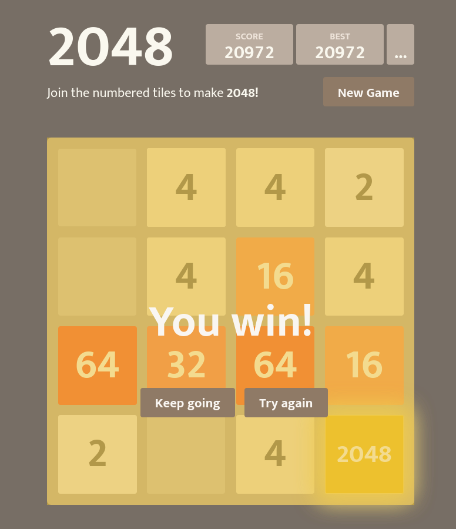

# 2048
[2048.whateverdev.com](https://2048.whateverdev.com/)

WhateverDev's take on the notorious 2048. This project is a fork of *Gabriele Cirulli's 2048* - a game inspired by *Veewo's 1024* and *Saming's 2048*.

## Screenshot

## Credits
**Gabriele Cirulli's 2048**
+ Author: [Gabriele Cirulli](https://github.com/gabrielecirulli)
+ Source: [GitHub](https://github.com/gabrielecirulli/2048)
+ Contributors:
  + [Anna Harren](https://github.com/iirelu)
  + [sigod](https://github.com/sigod)
  + [TimPetricola](https://github.com/TimPetricola)
  + [chrisprice](https://github.com/chrisprice)
  + [marcingajda](https://github.com/marcingajda)
  + [mgarciaisaia](https://github.com/mgarciaisaia)
  + [rayhaanj](https://github.com/rayhaanj)
  + [Mechazawa](https://github.com/Mechazawa)
  + [grant](https://github.com/grant)
  + [remram44](https://github.com/remram44)
  + [ghoullier](https://github.com/ghoullier)

## License
This project is distributed on GitLab under the MIT License.

[LICENSE](https://gitlab.com/whateverdev/games/2048/-/blob/main/LICENSE)
